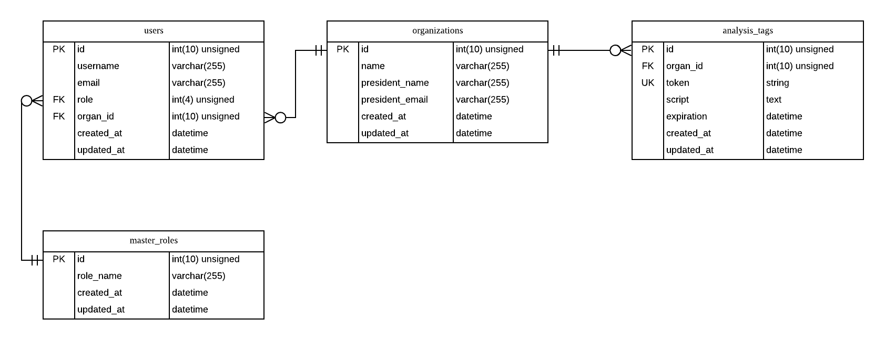
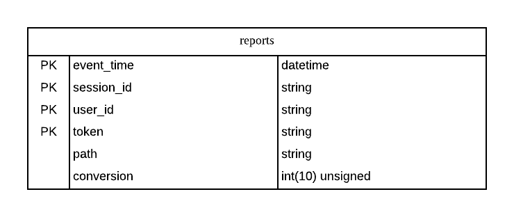
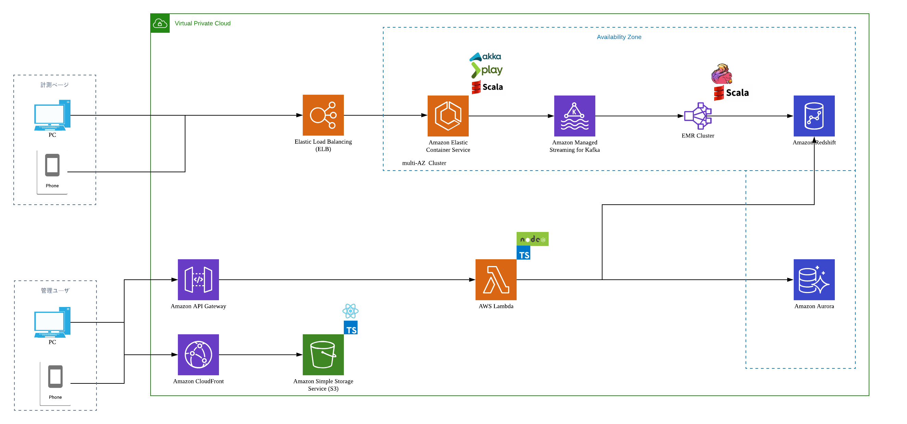

# Design A Google Analytics like System

## 概要
Google Analyticsのような機能を有するサービスを提供する.

## 必須要件
本サービスを実装するにあたって必須となる要件を以下に示す.

* デイリー数十億件の書き込みイベントが発生する
* 数百万人のユーザが分析に使用するため大量の読み取りが発生する
  * 加えて時系列でデータを表示する
* データ反映の遅延は大きくとも1時間に抑える
* ダウンタイムが小さくなるようにする
* ロジックにバグがあった場合(障害発生時)は実行された箇所まで遡って実行できるようにする

## DB設計
### DBの選定
本サービスの要件を満たすためのDBを選定する.  
DBとしては以下の2種類のDBを利用することを想定している.

* RDBMS
  * 本サービスを利用するユーザの情報
  * 計測タグの情報
* DWH
  * 計測結果の情報

### 指標について
本サービスはWebページに訪問するユーザの行動を分析するためのサービスである.  
そのため, 本サービスでは分析するための指標を用意する必要がある.  
以下に指標となりうる項目を挙げる(以下はGoogle Analyticsでの指標).

* ユーザに関する指標
  * セッション
  * ユーザ
  * ページビュー数
  * ページ/セッション
  * 平均セッション時間
  * 直帰率
  * 新規セッション率
* 行動に関する指標
  * ページビュー数
  * ページ別訪問回数
  * 平均ページ滞在時間
  * 閲覧開始数
  * 直帰率
  * 離脱率
  * ページの価値
* 目標・コンバージョンに関する指標
  * 目標の完了数
  * 目標値
  * コンバージョン率
  * 目標の放棄率

上記の項目のうちいくつかは別の指標がわかれば導出できるものとなっている(特に割合関係).  
そのため, ベースとなる指標を用意し, それらを取得できるようにする.  
ベースとする指標は以下の通り.

* セッションID
* ユーザID
* ページ(パス)
* コンバージョン
* イベント発火時刻

### カラム定義
上記の指標を基にカラムを決定する. 
以下にテーブル構造を示す.  
図1) RDBMSのテーブル構成  

図2) 集計用のDBのテーブル構成  

## 外部設計
計測ツールがブラウザで発火した時に情報を送信するためのエンドポイントを以下に示す.

* 管理者用サービス
  * 管理者アカウント情報のためのエンドポイント
  * 計測用のタグを発行するエンドポイント
  * 計測された情報を取得するためのエンドポイント
* 計測用の情報を送るエンドポイント
  * アクセス時の情報送信
    * セッションID, ユーザID, ページ(パス), イベント発火時刻を送信
    * セッションID, ユーザIDがなければないものを発行してセッションID, ユーザIDを返す
    * セッションID, ユーザIDがあればセッションID, ユーザIDをそのまま返す
      * セッションIDがあってもExpireしていれば新しいセッションIDにして返す
    * この情報はCookieに保持する
  * ページ離脱時の情報送信
    * セッションID, ユーザID, ページ(パス), イベント発火時刻を送信
    * レスポンスは特になし
  * コンバージョン時の情報送信
    * セッションID, ユーザID, ページ(パス), イベント発火時刻を送信
    * レスポンスは特になし

## 詳細設計
本件は新規プロダクトということもあり, クラウドにて構築する.  
そのモチベーションとしては以下の通り.

* 初期投資コストを減らせる
* ある程度はスケールさせることができる
* サーバのセットアップをある程度省略できるためソフトウェア開発に注力できる

### Infrastructure
必須要件として大量のデータの書き込みイベントが発生する. 
また, 加えてリアルタイムにデータ読み取りがなされる.  
Read/Writeの書き込みイベント量は以下の通り.

* Read
  * およそ数百万のユーザが時系列に見るため毎時間百万ユーザに確認されると仮定すると `1,000,000 req/hour`
  * 秒間リクエスト数は `278 req/sec`
* Write
  * `1,000,000,000 req/day` なので秒間リクエスト数に換算すると `11574 req/sec` 

このことからデータの処理はストリーム処理で実現するのが好ましいと思われる.  
このストリーム処理を実現するために[`Apache Kafka`](https://kafka.apache.org/)と[`Apache Flink`](https://flink.apache.org/)を用いる.  
各システムを用いるモチベーションは以下の通り.

* `Apache Kafka`
  * 分散メッセージングシステムであり, 大容量のデータを高スループット/低レイテンシで扱うことを目的としている
  * クラスタを構成するため, 耐障害性に優れる
  * シングルクラスタで大量のデータを扱うことができ, なおかつダウンタイムなしで透過的にスケールさせることができる
  * [参考](https://deeeet.com/writing/2015/09/01/apache-kafka/)
  * 別候補として [`Amazon Kinesis`](https://aws.amazon.com/jp/kinesis/)があるが大規模システムを構築するにあたっては `Apache Kafka` のほうに軍配が上がる模様
    * [参考](https://www.slideshare.net/laclefyoshi/kafkaaws-kinesis#15)によるとKinesisはおよそ `5000 msgs/sec` 以下で用いるのが妥当とのこと
    * 今回の想定メッセージ数は秒間 `10000 msgs/sec` を超えているので `Apache Kafka` を用いる
* `Apache Flink`
  * 分散ストリーム処理を行うフレームワークの一つであり, 高パフォーマンス, 低レイテンシで処理することができる
  * ステートフルであり, 障害発生時はその状態を元に処理を再開することができるため(Exactly Once)耐障害性に優れる
  * バッチ処理も可能
  * [参考](https://qiita.com/takanorig/items/e9880813798f0ac5679d)

### Application Server
上記の外部設計を満たすためのアプリケーションサーバを実装する必要がある.  
特に上記のタグ発行以外はリクエスト数が膨大になるためそれに耐えうるように実装しなければならない.  
まず言語選定だが `Scala` を用いることとする.  
主な理由としては以下の通り.

* `Apache Flink` で無限ストリームを扱う場合の選択肢は `Java` か `Scala` となるため, 言語を統一した方が学習コストの面から見ても効率が良いと考えたため
  * Table APIも同じ選択肢となることから `Java` か `Scala` にするのが良いと判断
* 静的型付け言語であること
  * 型による保証があるため開発時に安心感がある
* Immutableな構造を扱いやすく, かつコレクションの扱いが `Java` よりも容易であること

これらのことから `Scala` を用いて実装を行うことにする.  
ここでフレームワークとしては[`Play Framework2`](https://www.playframework.com/)を用いて実装を行うことにする.  
他のフレームワーク候補としては `finagle` が挙げられる.__
`Play Framework2` を使うモチベーションとしては以下の通り.  

* バックエンドが[`Akka-HTTP`](https://www.playframework.com/documentation/2.7.x/AkkaHttpServer)なので `Actor Model` を適用した開発ができること
  * 耐障害性
  * スケールアップ/アウトが容易
* `Scala` でのWebアプリケーションのデファクトスタンダードの地位を築いていること
  * ドキュメントやQ&Aが充実しているためキャッチアップが容易

### Management Application (UI)
計測タグを発行したり計測された情報を確認/分析する管理用アプリケーションが必要となる.  
本システムでは各種分析ページはおおよそ類似した構成になること, タグ発行などの機能ページはそれほど多くないことからSPAで実装を行うこととする.  
そのために用いるライブラリとして[`React`](https://reactjs.org/)と[`TypeScript`](https://www.typescriptlang.org/)を用いる. 
これらを用いるモチベーションとしては以下の通り.

* `React`
  * 描画ロジックを `JavaScript` で記述可能
  * メンテナンス/再利用性に優れる
  * ドキュメントの豊富さ
  * 双方向バインディングではないためコードで理解しやすい
  * 型による恩恵が受けやすい
    * 同じくFacebook社の開発した[`Flow`](https://flow.org/)があることもあって型の導入が容易に感じる
* `TypeScript`
  * 型によるオブジェクトの担保が可能

候補として挙げられるライブラリとしては[`Vue.js`](https://jp.vuejs.org/index.html)があるがこちらは

* 開発速度が早い
* 1つのファイルでロジック/UI/デザインが扱える
* ドキュメントが充実している

といったメリットはあるものの大規模開発に関してだと `Vue.js` は様々な書き方が可能となってしまい, 保守が大変になることが考えられる.  
また, 後述のAPI部にも関わるが `JavaScript(TypeScript)` を中心に開発していく `React` のほうが選定として妥当と判断した.

### Management Application (API)
上記の管理用アプリケーションはSPAとなるため情報を取得するためのAPIが必要となる.  
そこでAPI部分は[`Lambda`](https://docs.aws.amazon.com/ja_jp/lambda/latest/dg/welcome.html)を用いることとする.  
この `Lambda` の関数部は `TypeScript` によって記述することとする. 
これらを用いるモチベーションとしては以下の通り.

* `Lambda` によりAPIサーバの構築のコストを減らす
* フロント開発している人も必要なAPIを自分で作成することができる

これらのサーバ構成をまとめた図を以下に添付する.  
図3) サーバ構成  

